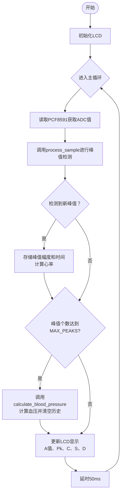

```mermaid
flowchart TD
    Start([开始]) --> Init[初始化LCD]
    Init --> LoopStart{进入主循环}
    
    LoopStart --> ReadADC[读取PCF8591获取ADC值]
    ReadADC --> PeakDetect[调用process_sample进行峰值检测]
    PeakDetect --> NewPeak{检测到新峰值？}
    
    NewPeak -- 是 --> StorePeak[存储峰值幅度和时间<br>计算心率]
    StorePeak --> CheckFull
    NewPeak -- 否 --> CheckFull
    
    CheckFull{峰值个数达到MAX_PEAKS?}
    CheckFull -- 是 --> CalcBP[调用calculate_blood_pressure<br>计算血压并清空历史]
    CalcBP --> Display
    CheckFull -- 否 --> Display
    
    Display[更新LCD显示<br>A值、Pk、C、S、D]
    Display --> Delay[延时50ms]
    Delay --> LoopStart
```
